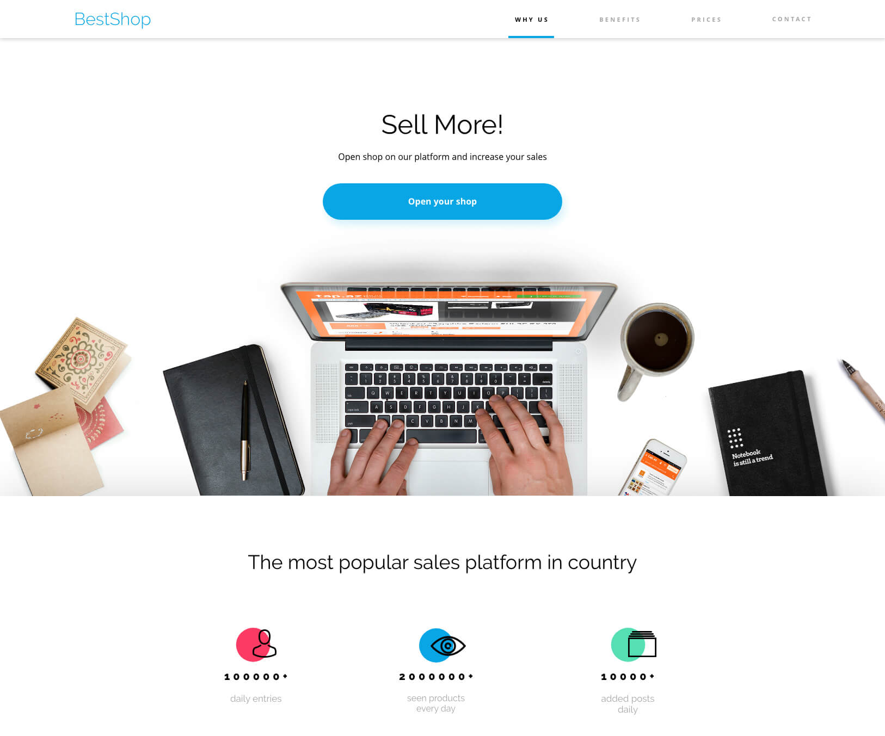

# BestShop - online shop management system
Presentation page for a company that offers online shop management services and provides the appropriate software for this.

## Introduction to the BestShop workshop
As you already know, the goal of today's workshop is to create a one-page BestShop. It is a presentation page for a company that offers online shop management services and provides the appropriate software for this. The project is invented solely for the purpose of this workshop.

You will find the whole project here: https://xd.adobe.com/view/31804ad0-5f57-46e0-6edf-a5f54c37078a-47b1/grid.

The page consists of several sections which we will discuss in subsequent articles. It has a minimalist design and is limited to a few basic colors and fonts.

## What will you learn in this workshop?
The workshop in the form of one large task, which is to "cut" and style the prepared view. It certainly gives a large portion of practical knowledge and allows you to use developer tools, AdobeXD, and CSS code faster and more confidently.

This project uses practically all the things we have talked about during this module, such as:

- variables,
- use of the calc method,
- attaching external fonts,
- shadows and rounding,
- styling of forms and their non-standard elements (e.g. checkbox),
- using pseudo-elements and pseudo-classes.
It will be possible to use all of these elements for this project! This will certainly consolidate your knowledge.

### Phase 1 - Advanced HTML and CSS 
https://lms.coderslab.cz/material/37/1-10/0cd0ecce-fe37-43e6-9be4-4ff86dfe6482